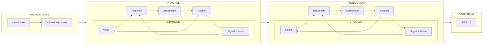

# Detection Threshold in Ordinary Space

日常空間における検出閾

Experiment Design

```mermaid
  flowchart LR

	subgraph INSTRUCTIONS
		direction LR
  		I[Instructions] --> V[Volume Adjusment]
	end
	
	subgraph PRACTICE
		direction LR
		F1[Fixation]
		subgraph STIMULUS 
			N1[Noise]
			SN1[Signal + Noise]
		end
		R1[Response]
		A1[Assesment]
	end

	F1[Fixation] --> N1
	F1[Fixation] --> SN1
	N1 --> R1[Response]
	SN1 --> R1[Response]
	R1 --> A1[Assesment]
	A1 --> F1

	subgraph PRODUCTION
		direction LR
		F2[Fixation]
		subgraph STIMULUS 
			N2[Noise]
			SN2[Signal + Noise]
		end
		R2[Response]
		A2[Assesment]
	end

	F2[Fixation] --> N2
	F2[Fixation] --> SN2
	N2 --> R2[Response]
	SN2 --> R2[Response]
	R2 --> A2[Assesment]
	A2 --> F2	

	subgraph DEBRIEFING
		RESULT
	end
  
	INSTRUCTIONS --> PRACTICE
	PRACTICE --> PRODUCTION
	--> DEBRIEFING


```

TODO: ROCというので分析？

